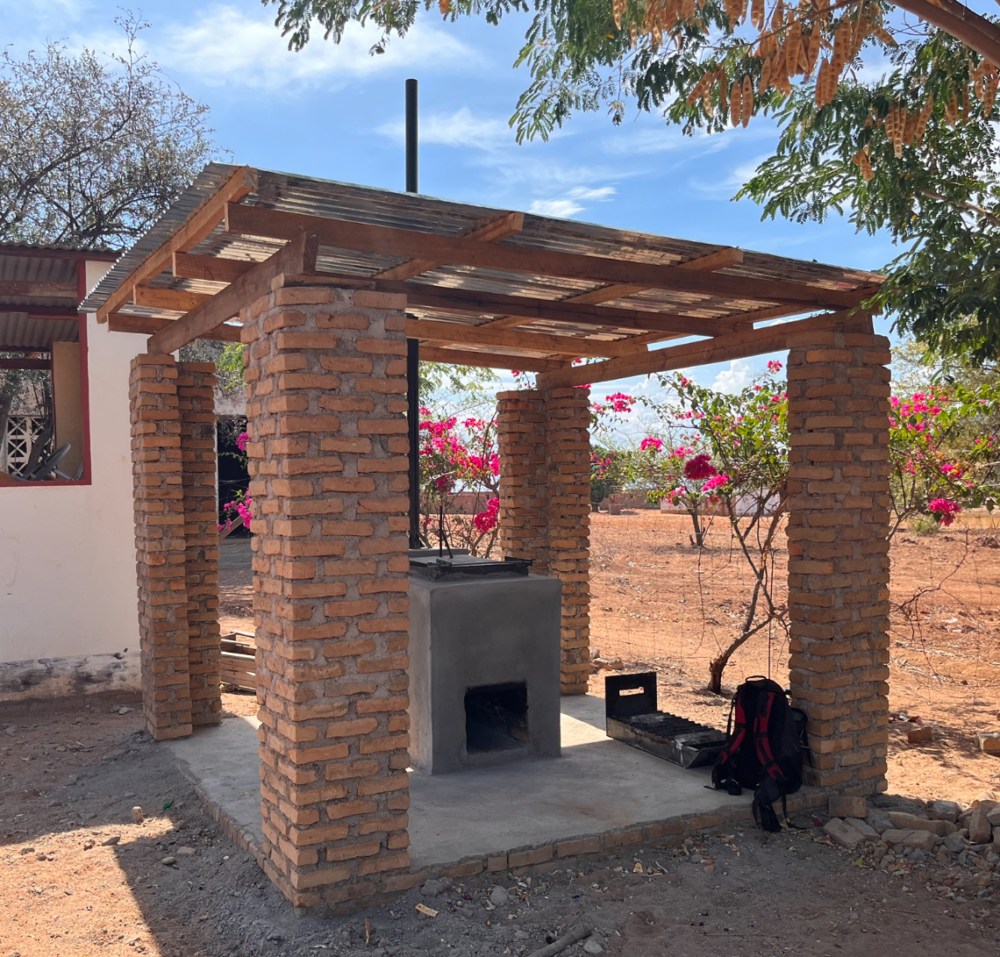

# incinerator-design-cape-maclear
<!-- badges: start -->

<!-- badges: end -->

<h1> Development of a Low-Cost Incinerator in Cape Maclear, Malawi </h1>

<b>Contributors</b>  
- Mosè Peduzzi <a href="https://orcid.org/0009-0004-6055-3835">
 0009-0004-6055-3835
</a> *author*  
- Jakub Tkaczuk <a href="https://orcid.org/0000-0001-7997-9423">
 0000-0001-7997-9423
</a> *supervisor, maintainer, developer*  
- Elizabeth Tilley <a href="https://orcid.org/0000-0002-2095-9724">
 0000-0002-2095-9724
</a> *supervisor*  

 

  
<b>Complete description of system design, functionalities, operation, and maintenance is available on: 
<a href="https://global-health-engineering.github.io/incinerator-design-cape-maclear/">Github pages</a>.
</b>
  
It compliments the openly-accessible master’s thesis, available on the   
<a href="https://www.research-collection.ethz.ch/handle/20.500.11850/670633">ETH Research Collection</a>
  
and the introduction video available on 
<a href="https://www.youtube.com/watch?v=6FmEJcynxZE">Youtube</a>.

# Background

This repository presents the construction of a modified De Montfort Incinerator Mark 8A, designed and built between October and December 2023 in Cape Maclear, Malawi. The incinerator has several modifications implemented, compared to the original design, e.g., the ash collection drawer and the cyclone separator to filter the flue gases.

The construction of the incinerator is part of a broader project conducted by Global Health Engineering, an ETH research group, aiming to introduce regular waste collection in the township of Cape Maclear, Malawi, ensuring safe waste disposal and minimizing environmental contamination. The incinerator constructed within this work reduces waste volume and makes hazardous waste harmless, emphasizing cost-effectiveness.

# License

This work is licensed under
[Creative Commons Attribution 4.0 International](https://github.com/Global-Health-Engineering/incinerator-design-cape-maclear/blob/main/LICENSE.md).
