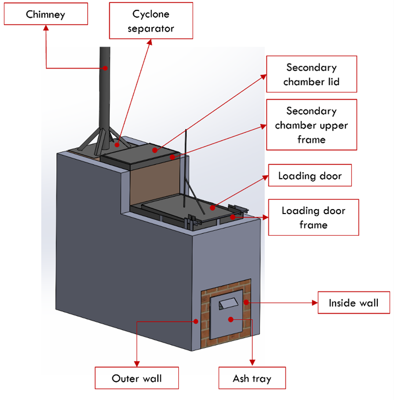

# incinerator-design-cape-maclear
<!-- badges: start -->

<!-- badges: end -->

<h1> Development of a Low-Cost Incinerator in Cape Maclear, Malawi </h1>

<b>Contributors</b>  
- Mosè Peduzzi <a href="https://orcid.org/0009-0004-6055-3835">
 0009-0004-6055-3835
</a> *author*  
- Jakub Tkaczuk <a href="https://orcid.org/0000-0001-7997-9423">
 0000-0001-7997-9423
</a> *supervisor, maintainer, developer*  
- Elizabeth Tilley <a href="https://orcid.org/0000-0002-2095-9724">
 0000-0002-2095-9724
</a> *supervisor*  

 

 
<b>Complete description of system design, functionalities, operation, and maintenance is available on: 
<a href="https://global-health-engineering.github.io/incinerator-design-cape-maclear/">Github pages</a>.
</b>
 
It compliments the openly-accessible master’s thesis, available on the   
<a href="https://www.research-collection.ethz.ch/handle/20.500.11850/670633">ETH Research Collection</a>.
 
and the introduction video available on Youtube 
LINK

# Background

This document present the construction of a modified De Montfort Incinerator Mark 8A, which was designed and built between October and December 2023 in Cape Maclear, Malawi. The incinerator presents several modifications compared to the original design, particularly an ash collection box and a cyclone separator to filter the outgoing gases.

The construction of this incinerator is part of a broader project, conducted by Global Health Engineering, a ETH research group, aiming to introduce regular waste collection in the township of Cape Maclear, Malawi, ensuring safe waste disposal and minimizing contamination as much as possible. 
The main goal of the incinerator is to reduce waste volume and make hazardous waste harmless, emphasizing cost-effectiveness and minimizing risks.

 
{width=60%}

# License

This work is licensed under
[Creative Commons Attribution 4.0 International](https://github.com/Global-Health-Engineering/incinerator-design-cape-maclear/blob/main/LICENSE.md).
